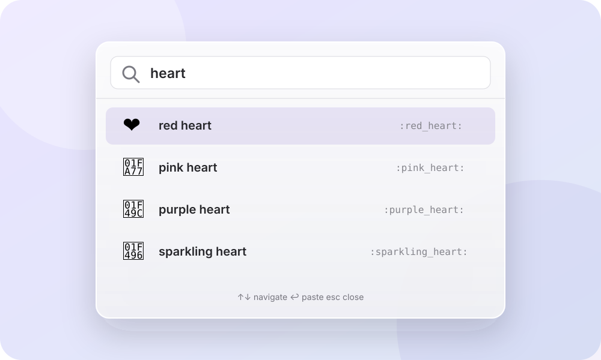

<p align="center">
  
</p>

<h1 align="center">Spotmoji</h1>

<p align="center">
  Find an emoji from Spotlight and paste it back into the app you were using.
</p>

<p align="center">
  <a href="https://omarknows.app/spotmoji/"></a>
  <a href="https://github.com/omarshahine/spotmoji/actions/workflows/ci.yml"></a>
  <a href="LICENSE"></a>
</p>

Spotmoji is a focused, native macOS emoji picker. It indexes the Unicode emoji catalog with Core Spotlight, understands human searches like `high five`, `coder`, and `face palm`, and uses the system pasteboard to put your selection where you were typing.

<p align="center">
  
</p>

## Install

### Homebrew

```sh
brew install --cask omarshahine/tap/spotmoji
```

Release builds are signed with Developer ID and notarized by Apple.

### Build from source

```sh
git clone https://github.com/omarshahine/spotmoji.git
cd spotmoji
./scripts/build-app.sh
open dist/Spotmoji.app
```

The build script uses Swift Package Manager and produces `dist/Spotmoji.app`. Sparkle is the only runtime package.

## Use it

### From Spotlight

1. Press <kbd>Command</kbd> + <kbd>Space</kbd>.
2. Type `Spotmoji` plus an emoji name, such as `Spotmoji threads`.
3. Select the emoji result and press <kbd>Return</kbd>.

Spotmoji opens invisibly, copies the emoji, returns focus to the app you were using, pastes, and quits.

### With the picker

1. Open **Spotmoji** from Spotlight.
2. Search by name, shortcode, group, or related term.
3. Use the arrow keys and press <kbd>Return</kbd> to paste.

macOS asks for Accessibility permission once so Spotmoji can return focus and send the paste command. If permission is not granted, the selected emoji is still copied.

## Why Spotmoji?

- **Spotlight first.** Emoji become native searchable Spotlight results.
- **Human-friendly search.** Common aliases, related concepts, compact shortcodes, plurals, and small typos all work.
- **Fast keyboard flow.** Search, arrows, Return. No mouse required.
- **Local and private.** No account, analytics, or cloud service. Search terms never leave your Mac.
- **Secure self-updates.** When the picker is open, Spotmoji periodically checks the signed release feed. Sparkle presents its native update window when a new version is available, and the picker keeps an update button for reopening it.
- **Native macOS.** AppKit, Core Spotlight, and the system emoji font. Nothing web-wrapped.
- **Small footprint.** One native app, Sparkle, and the bundled Unicode catalog.

## How it works

```text
Spotlight query
      |
      v
Core Spotlight index  ->  Spotmoji searchable item
                              |
                              v
                     Copy emoji to pasteboard
                              |
                              v
                 Restore target app and paste
```

Spotlight does not allow third-party apps to embed a live custom picker inside its window. Spotmoji uses the two supported native paths instead:

- Individual emoji are indexed as Spotlight results. Selecting one pastes it directly.
- The generic **Search Spotmoji** action opens the compact native picker with the query carried over.

## Design decisions

| Decision | Why |
|---|---|
| AppKit instead of SwiftUI | A non-activating floating panel and precise keyboard focus are central to the experience. |
| Core Spotlight index | Emoji appear as native system search results without replacing Spotlight. |
| Sparkle for direct updates | Signed appcasts and EdDSA-signed archives provide a native update path without invoking Homebrew from the app. |
| Weighted local search | Names and strong human aliases outrank broad related concepts, while typo correction runs only when an exact search has no results. |
| Accessibility only for paste | Search and copy work without it. The permission is used only to restore the target and send Command-V. |
| Public GitHub releases plus a Homebrew tap | The source, signed binaries, and one-command installation stay easy to inspect. |

## Development

Requirements: macOS 14 or later and Swift 6.2 or later.

```sh
swift test
./scripts/build-app.sh
codesign --verify --deep --strict --verbose=2 dist/Spotmoji.app
```

The emoji catalog generator lives in `Tools/generate_emoji_data.swift`. Human search metadata is checked in as a generated resource so the app stays offline and dependency-free at runtime. Regenerate it from pinned Emojibase and emojilib versions with:

```sh
./scripts/update-search-data.sh
```

Third-party software and data licenses are in [THIRD_PARTY_NOTICES.md](THIRD_PARTY_NOTICES.md). Release signing, notarization, Sparkle publication, and Homebrew publication are documented in [docs/RELEASING.md](docs/RELEASING.md).

## Privacy

Spotmoji does not collect or transmit data. See [PRIVACY.md](PRIVACY.md) for the exact local system features it uses.

## Roadmap

Homebrew is the first distribution channel. A Mac App Store build is planned after the direct distribution flow is established.

## License

MIT. See [LICENSE](LICENSE).
